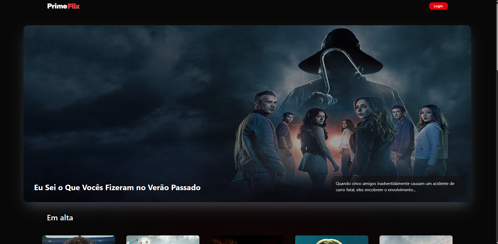

# 🎬 PrimeFlix

**PrimeFlix** é um aplicativo web **Full Stack** desenvolvido com **Next.js**, **TypeScript**, **Node.js**, **Express** e **Prisma**, que consome a API pública do [The Movie Database (TMDb)](https://www.themoviedb.org/) para exibir filmes em cartaz, lançamentos e seus respectivos detalhes.

O projeto também possui um backend próprio com banco de dados **PostgreSQL**, onde cada usuário autenticado pode registrar-se, fazer login e salvar filmes em sua lista pessoal. As rotas são protegidas tanto no frontend quanto no backend com **JWT (JSON Web Token)**.



---

## 🚀 Tecnologias Utilizadas

### Front-end
- **React.js**
- **Next.js 15**
- **TypeScript**
- **Tailwind CSS**
- **HTML5 & CSS3**
- **JavaScript**

### Back-end
- **Node.js**
- **Express.js**
- **Prisma ORM**
- **JWT para autenticação**
- **API TMDb**

### Banco de Dados
- **PostgreSQL**

---

## 📱 Responsividade

- Interface dinâmica e adaptada para **dispositivos móveis e desktops**.
- Navegação rápida com experiência otimizada para o usuário.

---

## 🔐 Funcionalidades de Segurança

- Registro e login de usuários com **criptografia de senha**
- Sessão de usuário protegida com **JWT**
- Rotas protegidas no frontend (Next.js) e backend (Express)
- Middleware de autenticação nas requisições privadas

---

## 🎥 Funcionalidades da Aplicação

- ✅ Listagem de **filmes em cartaz** e **lançamentos**
- ✅ Exibição de **detalhes completos** de cada filme:
  - Banner
  - Logotipo
  - Sinopse
  - Gêneros e categorias
  - Idioma original
  - Local de produção
  - Nome dos atores principais
  - Nome dos estúdios e autores
  - Data de lançamento
  - Nota média (usuários/críticos)
  - Link para trailer no YouTube
- ✅ Integração com **API pública do TMDb**
- ✅ Possibilidade de **salvar filmes favoritos** na conta do usuário
- ✅ Dados persistidos por usuário autenticado
- ✅ Estrutura de componentes reutilizáveis e organizada

---

## 🗄️ Estrutura Back-end

- `POST /register` - Criação de usuário
- `POST /login` - Login e geração de token JWT
- `GET /me` - Retorna dados do usuário autenticado
- `POST /movies` - Adiciona filme à lista pessoal
- `GET /movies` - Lista filmes salvos do usuário
- Middleware para verificação de token em todas as rotas privadas

---

## 🧠 Aprendizados & Propósito

Este projeto foi desenvolvido com o intuito de consolidar conhecimentos em:
- Arquitetura Full Stack moderna
- Criação de aplicações com **Next.js App Router**
- Consumo de API externa REST
- Gerenciamento de autenticação segura com **JWT**
- Organização de banco de dados com **Prisma e PostgreSQL**
- Experiência real de desenvolvimento com **rotas dinâmicas protegidas**
- Deploy de aplicações modernas e escaláveis

---

## 🔗 API Utilizada

- [The Movie Database (TMDb)](https://developer.themoviedb.org/docs)

---

## 📸 Preview

🔜 (Adicione aqui imagens ou um link para o deploy no Vercel)

---

## 📦 Instalação Local

```bash
# Clone o repositório
git clone https://github.com/seu-usuario/primeflix.git

# Acesse o diretório
cd primeflix

# Instale as dependências do frontend
cd frontEnd_primeflix
npm install

# Inicie o frontend
npm run dev

# Em outra aba, vá para o backend
cd ../backEnd_primeflix
npm install

# Configure as variáveis de ambiente (.env) e execute o servidor
npx prisma generate
npx prisma migrate dev
npm run dev
